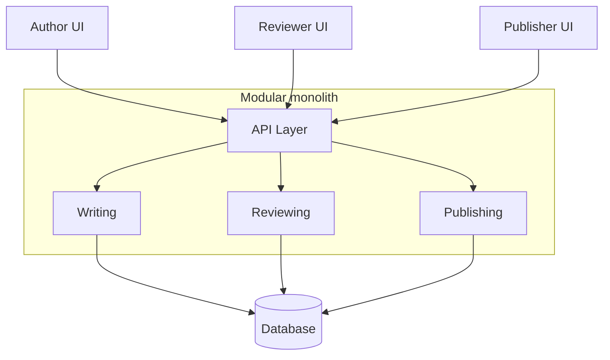

# Agile Dead Trees

URL: https://www.architecturalkatas.com/kata.html?kata=AgileDeadTrees.json

A publisher wants to unify its authoring CMS and customer store experience

Users: dozens of publisher employees, hundreds of authors, thousands/millions of customers

Requirements: authors publish chapters; reviewers see the chapters, make review comments, and notify authors after finishing a review; authors can reject proposed review changes; customers can buy books (either e-form or dead trees form) online, including those available in "beta"; a publisher can push authors' chapters to those customers who bought the "beta"

## Actors

| Actor     | Possible actions                                                                 |
| --------- | -------------------------------------------------------------------------------- |
| Author    | send new chapters for review, mark as BETA-ready, accept reviews, reject reviews |
| Reviewer  | List chapters, review chapters                                                   |
| Publisher | Mark book as ready for sale                                                      |

## "Drafting" bounded context

